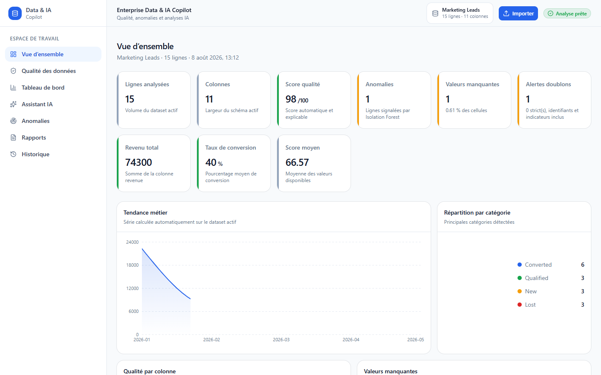
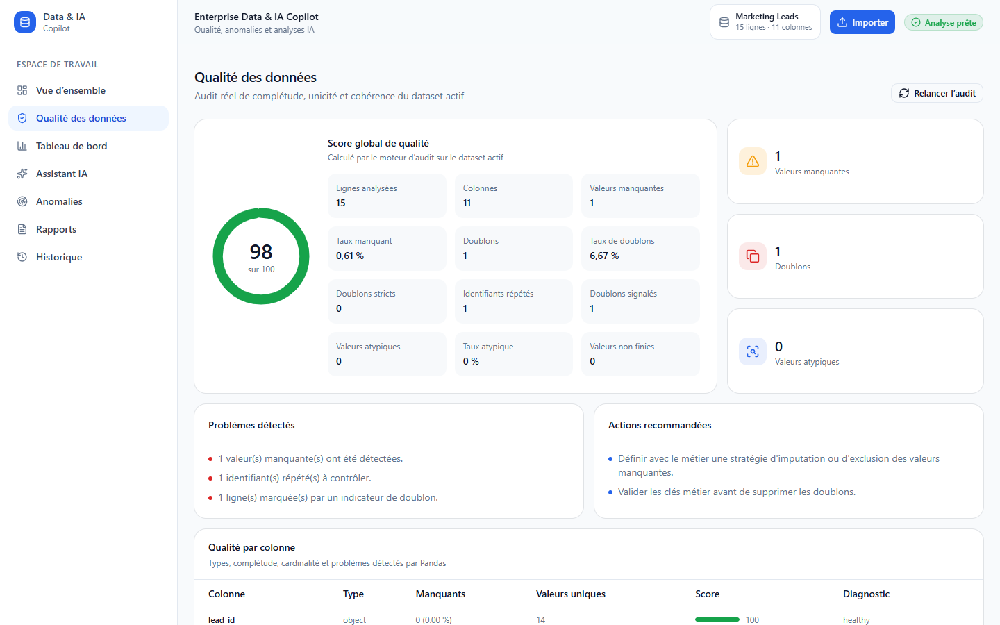
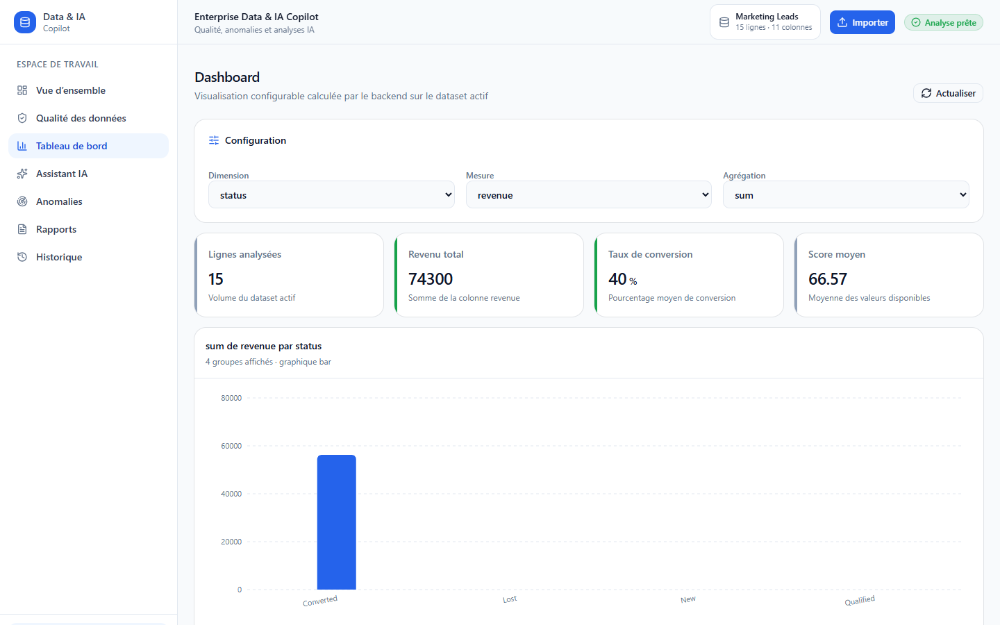
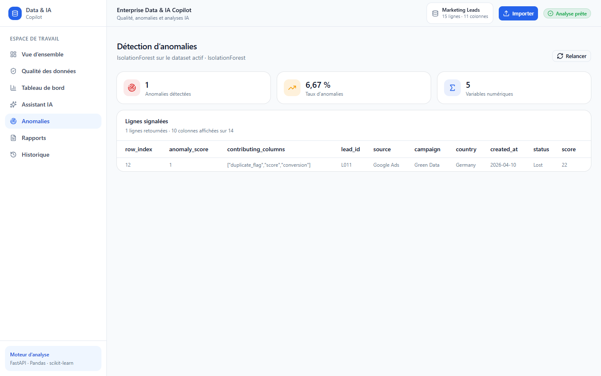

# Enterprise Data & IA Copilot

Plateforme SaaS de démonstration qui transforme un fichier CSV ou XLSX en espace d'analyse exploitable : indicateurs Pandas, audit Data Quality, graphiques interactifs, détection d'anomalies, assistant IA et rapports exportables.

Le projet est une application métier complète, pas un site vitrine. Toutes les valeurs affichées sont calculées par le backend FastAPI à partir du dataset actif.

[Démo en ligne](https://rare-communication-production.up.railway.app) · [CI GitHub Actions](https://github.com/benjAttack667/enterprise-data-ia-copilot/actions)

La démo publique est protégée par un mot de passe partagé. Elle doit être utilisée uniquement avec les datasets synthétiques fournis : ne téléversez aucune donnée personnelle ou confidentielle.

## Fonctionnalités

- import sécurisé de fichiers CSV et XLSX (50 Mio par défaut, limite configurable) ;
- accès de démonstration protégé par une session HTTP-only signée et une API FastAPI non exposée directement au navigateur ;
- profilage Pandas et KPI adaptés aux colonnes disponibles ;
- score Data Quality explicable, valeurs manquantes, identifiants répétés, doublons signalés, types mixtes et valeurs extrêmes ;
- dashboard Recharts configurable par dimension, mesure et agrégation ;
- détection multivariée avec `IsolationForest` et `random_state=42` ;
- synthèse et questions en langage naturel via l'API OpenAI ;
- fallback local déterministe lorsqu'aucune clé OpenAI n'est fournie ou que l'API est indisponible ;
- génération et téléchargement de rapports Markdown ou HTML ;
- historique réel des opérations dans SQLite.

## Stack

| Couche | Technologies |
| --- | --- |
| Frontend | Next.js, React, TypeScript, Tailwind CSS, shadcn/ui, Recharts, Lucide |
| Backend | FastAPI, Python, Pandas, NumPy, scikit-learn |
| IA | OpenAI Responses API avec fallback local |
| Persistance | SQLite pour l'historique, stockage local des imports et rapports |

Le navigateur communique uniquement avec le proxy same-origin Next.js. Après validation de la session, ce proxy ajoute côté serveur un jeton privé pour joindre FastAPI. Le mot de passe, le secret de session et le jeton backend ne sont jamais intégrés au bundle navigateur.

## Architecture

```text
enterprise-data-ia-copilot/
├── frontend/
│   ├── app/                 # routes Next.js App Router
│   ├── components/          # shell SaaS, états et composants métier
│   ├── lib/                 # client HTTP typé et hooks
│   └── package.json
├── backend/
│   ├── main.py              # routes FastAPI
│   ├── src/                 # qualité, analytics, IA, anomalies, rapports
│   ├── data/
│   │   ├── samples/         # quatre datasets de démonstration
│   │   └── uploads/         # fichiers importés, ignorés par Git
│   ├── reports/             # exports générés, ignorés par Git
│   ├── tests/
│   └── requirements.txt
├── docs/screenshots/
└── README.md
```

Le backend charge `marketing_leads.csv` au démarrage pour permettre une démonstration immédiate. Un import remplace le dataset actif pour l'ensemble des pages. L'historique SQLite persiste entre les redémarrages ; le dataset actif, lui, revient à l'échantillon par défaut au redémarrage.

## Installation sous Windows

Prérequis : Python 3.10 ou plus récent, Node.js 20.9 ou plus récent et npm.

### Terminal 1 — backend

Depuis la racine du projet :

```powershell
python -m venv .venv
& .\.venv\Scripts\python.exe -m pip install --upgrade pip
& .\.venv\Scripts\python.exe -m pip install -r .\backend\requirements.txt

Copy-Item .\backend\.env.example .\backend\.env
& .\.venv\Scripts\python.exe -m uvicorn backend.main:app --host 127.0.0.1 --port 8000 --reload
```

- API : `http://127.0.0.1:8000`
- Documentation interactive : `http://127.0.0.1:8000/docs`

### Terminal 2 — frontend

```powershell
Set-Location .\frontend
Copy-Item .\.env.example .\.env.local
npm install
npm run dev
```

Application : `http://localhost:3000`

Si votre réseau d'entreprise utilise son propre certificat et que npm échoue en TLS, relancez uniquement l'installation avec :

```powershell
$env:NODE_OPTIONS = '--use-system-ca'
npm install
```

## Configuration

`backend/.env` :

```dotenv
COPILOT_ENVIRONMENT=local
BACKEND_SERVICE_TOKEN=<jeton-aléatoire-identique-au-frontend>
API_DOCS_ENABLED=true

OPENAI_API_KEY=
OPENAI_MODEL=gpt-4.1-mini
FRONTEND_ORIGINS=http://localhost:3000,http://127.0.0.1:3000
MAX_UPLOAD_BYTES=52428800
```

`frontend/.env.local` :

```dotenv
BACKEND_INTERNAL_URL=http://127.0.0.1:8000
BACKEND_SERVICE_TOKEN=<jeton-aléatoire-identique-au-backend>
DEMO_ACCESS_PASSWORD=<mot-de-passe-fort>
SESSION_SECRET=<secret-aléatoire-de-32-octets-minimum>
```

Générez séparément le jeton backend et le secret de session avec `python -c "import secrets; print(secrets.token_urlsafe(48))"`. Utilisez une troisième valeur forte comme mot de passe de démonstration. Ne commitez jamais ces valeurs.

La clé OpenAI reste exclusivement côté serveur. Lorsqu'elle est active, la question utilisateur, le schéma, les métadonnées, les KPI et les statistiques agrégées sont envoyés au modèle — jamais le fichier complet ni ses lignes brutes. L'appel Responses API utilise `store=False`. Sans clé, en cas de timeout, de quota ou de clé invalide, l'interface affiche explicitement le mode local.

## Exécution avec Docker Compose

Cette option lance le frontend et le backend dans deux conteneurs non privilégiés. Les imports, rapports et l'historique SQLite sont conservés dans le volume nommé `copilot-runtime` ; les datasets de démonstration restent intégrés à l'image backend.

```powershell
# Depuis la racine
Copy-Item .\.env.example .\.env
# Remplissez BACKEND_SERVICE_TOKEN, DEMO_ACCESS_PASSWORD et SESSION_SECRET
# avec trois secrets différents avant le premier démarrage.
docker compose up --build -d
docker compose ps
```

- Application : `http://localhost:3000`
- Documentation locale, si `API_DOCS_ENABLED=true` : `http://localhost:8000/docs`

Pour suivre les journaux puis arrêter la stack sans supprimer les données :

```powershell
docker compose logs -f
docker compose down
```

Les quatre variables de sécurité frontend sont injectées uniquement à l'exécution dans le serveur Next.js. Aucune variable `NEXT_PUBLIC_*` ne contient un secret. Dans Docker Compose, Next.js contacte FastAPI sur le réseau interne via `http://backend:8000`.

Si le réseau d'entreprise inspecte les connexions TLS, placez uniquement ses certificats d'autorité racine publics au format PEM (`.crt`) dans `docker/certs/` avant le build. Ils sont ignorés par Git ; aucune clé privée ne doit être copiée dans ce dossier. La vérification TLS reste active.

## Déploiement Railway sécurisé

Configurez les variables suivantes avant de déployer cette version. La présence de `RAILWAY_PROJECT_ID` place automatiquement le backend en mode production ; il refuse volontairement de démarrer si son jeton est absent ou fait moins de 32 octets.

Service backend :

```dotenv
COPILOT_ENVIRONMENT=production
BACKEND_SERVICE_TOKEN=<secret-aléatoire-partagé-avec-le-frontend>
API_DOCS_ENABLED=false
```

Service frontend :

```dotenv
BACKEND_INTERNAL_URL=http://<nom-du-service-backend>.railway.internal:8000
BACKEND_SERVICE_TOKEN=<même-secret-que-le-backend>
DEMO_ACCESS_PASSWORD=<mot-de-passe-fort-à-communiquer-aux-recruteurs>
SESSION_SECRET=<autre-secret-aléatoire-de-32-octets-minimum>
```

Utilisez une variable partagée Railway pour `BACKEND_SERVICE_TOKEN` afin d'éviter toute divergence. Le domaine public du backend peut rester disponible pour le healthcheck, mais toutes les routes métier répondent `401` sans ce jeton. `/api/health` reste public et ne divulgue aucune information sur le dataset.

## Routes frontend

| Route | Usage |
| --- | --- |
| `/login` | authentification de la démo et création de la session HTTP-only |
| `/` | vue opérationnelle et KPI du dataset actif |
| `/data-quality` | audit détaillé et priorités de correction |
| `/dashboard` | agrégations et graphiques interactifs |
| `/ai-assistant` | synthèse et questions sur les métriques calculées |
| `/anomalies` | résultats réels d'IsolationForest |
| `/reports` | génération, aperçu et téléchargement Markdown/HTML |
| `/history` | journal SQLite des opérations réalisées |

## API FastAPI

| Méthode | Endpoint | Résultat |
| --- | --- | --- |
| `POST` | `/api/upload` | valide, stocke et active un CSV/XLSX |
| `GET` | `/api/overview` | métadonnées, KPI et séries de synthèse |
| `GET` | `/api/data-quality` | score, contrôles par colonne et recommandations |
| `GET` | `/api/dashboard` | agrégation compatible Recharts |
| `POST` | `/api/ai-summary` | synthèse OpenAI ou locale |
| `POST` | `/api/ask` | réponse factuelle sur les agrégats disponibles |
| `GET` | `/api/anomalies` | lignes signalées par IsolationForest |
| `POST` | `/api/report` | rapport Markdown ou HTML réel |
| `GET` | `/api/history` | opérations persistées dans SQLite |

Un endpoint de santé minimal reste public sur `GET /api/health`. Toutes les autres routes FastAPI exigent le jeton `Authorization: Bearer <BACKEND_SERVICE_TOKEN>` ajouté par le proxy Next.js ; le navigateur ne possède jamais ce jeton. La documentation FastAPI est désactivée par défaut en production.

## Logique d'analyse

Le score Data Quality, borné entre 0 et 100, applique des pénalités déterministes : complétude (50 points), doublons ou identifiants répétés (25), valeurs extrêmes IQR (15), incohérences de type et valeurs infinies (10). Il sert à prioriser l'audit et ne remplace pas les règles métier.

Pour les anomalies, les colonnes numériques constantes sont exclues, les valeurs manquantes sont imputées par la médiane, puis les variables sont standardisées avant `IsolationForest`. Le score affiché classe les observations ; il ne représente ni une probabilité ni une causalité.

## Tests et qualité

```powershell
# Depuis la racine
& .\.venv\Scripts\python.exe -m pytest .\backend\tests -q

Set-Location .\frontend
npm run typecheck
npm run lint
npm run build
```

La suite backend utilise des répertoires et une base SQLite temporaires. Elle couvre notamment les dimensions des données, l'audit qualité, les agrégations, les imports CSV/XLSX, la sécurité des fichiers, l'authentification du service, le démarrage fail-closed, le fallback IA, les anomalies et les rapports.

### Parcours E2E avec Robot Framework

La suite Robot démarre automatiquement une stack isolée sur les ports `3100` et `8100`, pilote Chrome en mode headless, importe un vrai CSV et parcourt les sept pages. Les éventuels serveurs déjà ouverts sur `3000` et `8000` ne sont pas modifiés.

Les uploads, rapports et événements SQLite du parcours E2E sont écrits dans `tests/robot/results/runtime/`. Le run recrée cet espace avant chaque exécution : il ne modifie donc pas les données locales de démonstration du backend.

Le parcours comporte 14 scénarios : authentification, protection directe du backend, déconnexion, workflow nominal complet, XLSX corrompu, atomicité de l'import, détection non applicable, dataset entièrement numérique et indisponibilité de l'API.

```powershell
# Depuis la racine du projet
python -m pip install -r .\tests\robot\requirements.txt
python -m robot --outputdir .\tests\robot\results .\tests\robot\enterprise_data_ia.robot
```

Les preuves d'exécution sont générées dans `tests/robot/results/` : `report.html`, `log.html`, `output.xml`, journaux FastAPI/Next.js et captures automatiques en cas d'échec.

### Intégration continue

Le workflow GitHub Actions [`.github/workflows/ci.yml`](.github/workflows/ci.yml) exécute automatiquement Pytest, le contrôle TypeScript, ESLint, le build Next.js et les 14 scénarios Robot Framework. Les rapports E2E sont conservés comme artefact de CI pendant 14 jours, y compris lorsqu'un scénario échoue.

## Scénario de démonstration en entretien

1. Ouvrir la vue d'ensemble sur l'échantillon Marketing Leads.
2. Importer `backend/data/samples/packaging_data.csv` depuis la topbar.
3. Montrer que le contexte passe réellement à 12 lignes et 10 colonnes sur toutes les vues.
4. Expliquer le score Data Quality puis modifier dimension, mesure et agrégation dans le dashboard.
5. Relancer IsolationForest et examiner les colonnes contributrices d'une anomalie.
6. Poser une question à l'assistant, en montrant le badge OpenAI ou fallback local.
7. Générer un rapport HTML, le télécharger, puis retrouver l'opération dans l'historique SQLite.

## Captures d'écran

Les captures ci-dessous proviennent de l'application Docker réelle avec le dataset Marketing Leads, en 1440 × 900.

### Vue d'ensemble



### Audit Data Quality



### Dashboard métier



### Détection d'anomalies



## Limites assumées

Docker Compose rend l'exécution reproductible, mais ne remplace pas une plateforme SaaS multi-tenant : sauvegardes automatisées, rétention, quotas et orchestration distribuée restent à ajouter avant de traiter des données réelles.

Cette version implémente une barrière d'accès adaptée à une démonstration publique : mot de passe partagé, cookie HTTP-only signé et jeton privé entre Next.js et FastAPI. Elle ne fournit pas encore de comptes individuels, de rôles, d'isolation multi-tenant, de stockage objet cloud ni de file de tâches. Tous les utilisateurs autorisés partagent encore le même dataset actif. Les imports, rapports et événements SQLite sont conservés sans purge automatique ; en usage prolongé, il faut donc définir une politique de rétention ou nettoyer périodiquement `backend/data/uploads/`, `backend/reports/` et `backend/data/history.db`.
